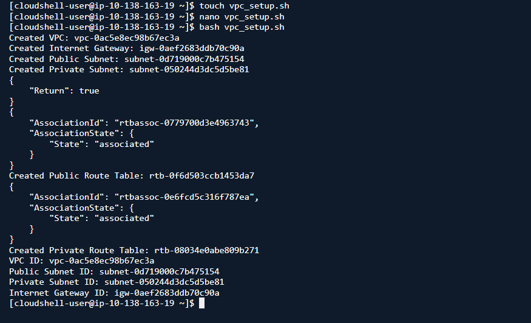
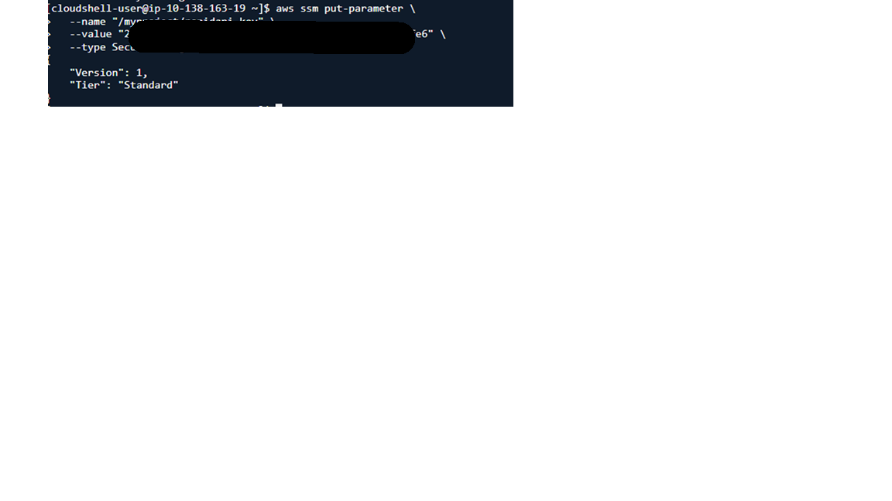

# NCAA-Game-Highlights Project

## Description
This project leverages RapidAPI to retrieve NCAA game highlights and utilizes a Docker container for seamless deployment. The obtained media files are then converted using AWS MediaConvert for optimal format and compatibility.

## Technical Diagram


## Prerequstes
To create a project that obtains NCAA game highlights using RapidAPI, Docker, and AWS MediaConvert, you'll need to meet the following prerequisites:

1- RapidAPI Account: Sign up for a RapidAPI account and subscribe to an API that provides NCAA game highlights.
parameter you should copy (x-rapidapi-key)

2- AWS Account: Ensure you have an AWS account with the necessary permissions to access services like S3, ECR, ECS, and MediaConvert.

3- Docker Installed: Install Docker on your system to run the containerized workflow.

4- Terraform Installed: Ensure Terraform is installed for infrastructure deployment.

5- Basic CLI Knowledge: Familiarity with using command-line tools for API requests, AWS configurations, and Terraform commands.

6- Git Installed: Install Git to clone the project repository.

7- Python Installed: Ensure Python is installed on your system.

## Project Structure

```src/
├── Dockerfile
├── config.py
├── fetch.py
├── mediaconvert_process.py
├── process_one_video.py
├── requirements.txt
├── run_all.py
├── .env
├── .gitignore
└── terraform/
    ├── main.tf
    ├── variables.tf
    ├── secrets.tf
    ├── iam.tf
    ├── ecr.tf
    ├── ecs.tf
    ├── s3.tf
    ├── container_definitions.tpl
    └── outputs.tf
```
Once you have these prerequisites, you can start setting up your project by cloning the repository, configuring your environment, and deploying your infrastructure using Terraform.

## Part 1: START HERE - Local

### Step 1: Clone The Repo

```
 https://github.com/mazin990/NCAA-Game-Highlights.git

 ```
### Step 2: Add API Key to AWS Secrets Manager
```
aws secretsmanager create-secret \
    --name my-api-key \
    --description "API key for accessing the Sport Highlights API" \
    --secret-string '{"api_key":"YOUR_ACTUAL_API_KEY"}' \
    --region us-east-1
```
### Step 3: Create an IAM role or user
1.	In the search bar, type "IAM".
2.	Click Roles -> Create Role.
3.	For the Use Case, enter "S3" and click next.
4.	Under Add Permission, search for and add:
    - AmazonS3FullAccess
	- MediaConvertFullAccess
	- AmazonEC2ContainerRegistryFullAccess
Click next.
1.	Under Role Details, enter "HighlightProcessorRole" as the name.
2.	Select Create Role.
3.	Find the role in the list and click on it.
4.	Under Trust relationships, edit the trust policy as follows:

```
{
  "Version": "2012-10-17",
  "Statement": [
    {
      "Effect": "Allow",
      "Principal": {
        "Service": [
          "ec2.amazonaws.com",
          "ecs-tasks.amazonaws.com",
          "mediaconvert.amazonaws.com"
        ],
        "AWS": "arn:aws:iam::<"your-account-id">:user/<"your-iam-user">"
      },
      "Action": "sts:AssumeRole"
    }
  ]
}
```


### Step 4: Create an S3 bucket using AWS CloudShell with the AWS CLI.

- Open AWS CloudShell, Go to the AWS Management Console,Launch CloudShell.

- Configure AWS CLI (if not already configured).

- Create an S3 Bucket:
 ```
 aws s3api create-bucket --bucket <your-unique-bucket-name> --region <your-region>
```

- Verify Bucket Creation:
```
aws s3 ls
```


### Step 5: Set Up Project (CloudShell)

1- Create the Projects Directory: 
```
  mkdir game-highlight-processor
  cd  game-highlight-processor
```

2- Create nessory file  
```
 touch Dokerfile fetch.py requirement.txt process_one_video.py mediaconvert_process.py run_all.py
```
3- Copy content of same file from Github and replaced for file in local and replace nessary.(copy $ paste)

### Step 6: Update .env file  (CloudShell)
- RapidAPI_KEY: Ensure that you have successfully created the account and select "Subscribe To Test" in the top left of the Sports Highlights API
- AWS_ACCESS_KEY_ID=your_aws_access_key_id_here
- AWS_SECRET_ACCESS_KEY=your_aws_secret_access_key_here
- S3_BUCKET_NAME=your_S3_bucket_name_here
- MEDIACONVERT_ENDPOINT=https://your_mediaconvert_endpoint_here.amazonaws.com
  
```
aws mediaconvert describe-endpoints
```
### Step 7: Secure .env file  (CloudShell)

```
chmod 600 .env
```

### Step 8: Locally Buikd & Run The Docker Container

```
docker build -t highlight-processor .
```


- Run the Docker Container Locally:

```
docker run --env-file .env highlight-processor
```


This will run fetch.py, process_one_video.py and mediaconvert_process.py and the following files should be saved in your S3 bucket


### Step 9: Empty bucket and deleted 


## Part 2: Terraform (IAC) 

### Step 1: Setup terraform.tfvars File

 1.  Copy all contents of the resources folder from the GitHub repository.
 2. In AWS CloudShell or VS Code terminal, create a new file named vpc_setup.sh.
 3. Paste the provided script into vpc_setup.sh.
 4. Run the vpc_setup.sh script.

  ```
 bash vpc_setup.sh
  ```
 

 5. You will see variables in the output, paste these variables into lines 8-13.
 6. Store your API key in AWS Secrets Manager

  ```
  aws ssm put-parameter \
  --name "/myproject/rapidapi_key" \
  --value "YOUR_SECRET_KEY" \
  --type SecureString
  ```
  

 7. Run the following script to obtain your mediaconvert_endpoint:

 ```
 aws mediaconvert describe-endpoints --query "Endpoints[0].Url" --output text
 ```
 8. Leave the mediaconvert_role_arn string empty

#### Helpful Tip for Beginners:

Use the same region, project, S3 Bucketname and ECR Repo name to make following along easier. Certain steps like pushing the docker image to the ECR repo is easier to copy and paste without remember what you named your repo

### Step 2: Run The Project

### Step 2: Run The Project

1. Navigate to the terraform folder/workspace in VS Code From the src folder

  ```
  cd terraform
  ```
2. Initialize terraform working directory

  ```
  terraform init
  ```


3. Check syntax and validity of your Terraform configuration files

  ```
  terraform validate
  ```


4. Display execution plan for the terraform configuration

  ```
  terraform plan
  ```


5. Apply changes to the desired state

  ```
  terraform apply -var-file="terraform.dev.tfvars"
  ```


6. Create an ECR Repo

  ```
  aws ecr create-repository --repository-name highlight-pipeline
  ```


7. Log into ECR

  ```
  aws ecr get-login-password --region us-east-1 | \
  docker login --username AWS --password-stdin <AWS_ACCOUNT_ID>.dkr.ecr.us-east-1.amazonaws.com
  ```

  ```
  docker push <AWS_ACCOUNT_ID>.dkr.ecr.<REGION>.amazonaws.com/highlight-pipeline:latest
  ```

### Step 3: Destroy ECS and ECR resources
In the AWS Cloudshell or vs code terminal, create the file ncaaprojectcleanup.sh and paste the script inside from the resources folder.

- Run the script

```
bash ncaaprojectcleanup.sh
```

### Review Video Files
Navigate to the S3 Bucket and confirm there is a json video in the highlights folder and a video in the videos folder


### What We Learned
- Deploying local docker images to ECR
- A high level overview of terraform files
- Networking - VPCs, Internet Gateways, private subnets and public subnets
- SSM for saving secrets and pulling into terraform
