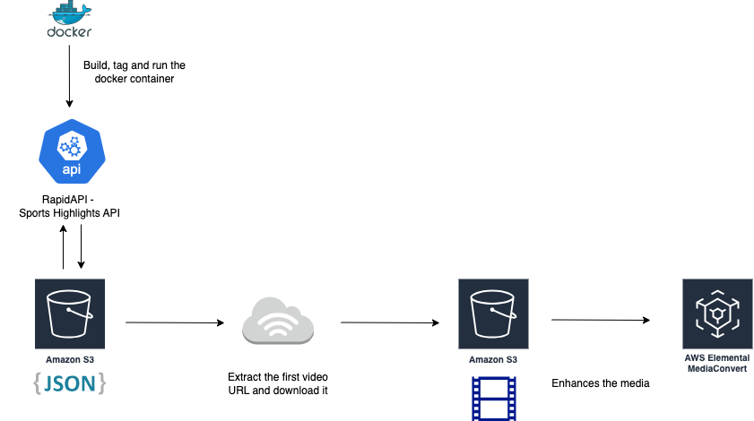

# NCAA-Game-Highlights Project

## Description
This project leverages RapidAPI to retrieve NCAA game highlights and utilizes a Docker container for seamless deployment. The obtained media files are then converted using AWS MediaConvert for optimal format and compatibility.

## Prerequstes
To create a project that obtains NCAA game highlights using RapidAPI, Docker, and AWS MediaConvert, you'll need to meet the following prerequisites:

1- RapidAPI Account: Sign up for a RapidAPI account and subscribe to an API that provides NCAA game highlights.
parameter you shoud copy (x-rapidapi-key)

2- AWS Account: Ensure you have an AWS account with the necessary permissions to access services like S3, ECR, ECS, and MediaConvert.

3- Docker Installed: Install Docker on your system to run the containerized workflow.

4- Terraform Installed: Ensure Terraform is installed for infrastructure deployment.

5- Basic CLI Knowledge: Familiarity with using command-line tools for API requests, AWS configurations, and Terraform commands.

6- Git Installed: Install Git to clone the project repository.

7- Python Installed: Ensure Python is installed on your system.

## Technical Diagram



## Project Structure

```src/
├── Dockerfile
├── config.py
├── fetch.py
├── mediaconvert_process.py
├── process_one_video.py
├── requirements.txt
├── run_all.py
├── .env
├── .gitignore
└── terraform/
    ├── main.tf
    ├── variables.tf
    ├── secrets.tf
    ├── iam.tf
    ├── ecr.tf
    ├── ecs.tf
    ├── s3.tf
    ├── container_definitions.tpl
    └── outputs.tf
```
Once you have these prerequisites in place, you can start setting up your project by cloning the repository, configuring your environment, and deploying your infrastructure using Terraform.

## START HERE - Local
### Step 1: Clone The Repo

```
 https://github.com/mazin990/NCAA-Game-Highlights.git

 ```
### Step 2: Add API Key to AWS Secrets Manager

```
aws secretsmanager create-secret \
    --name my-api-key \
    --description "API key for accessing the Sport Highlights API" \
    --secret-string '{"api_key":"YOUR_ACTUAL_API_KEY"}' \
    --region us-east-1
```

